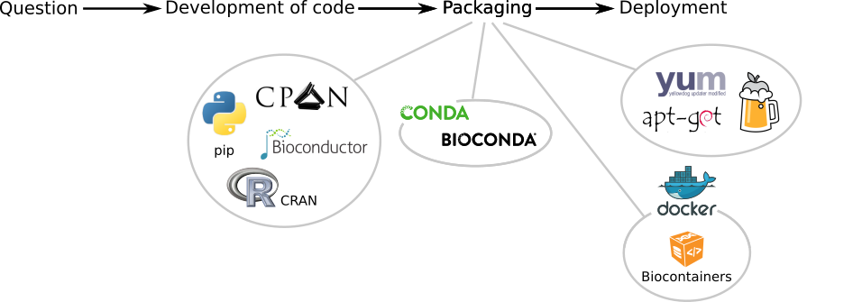
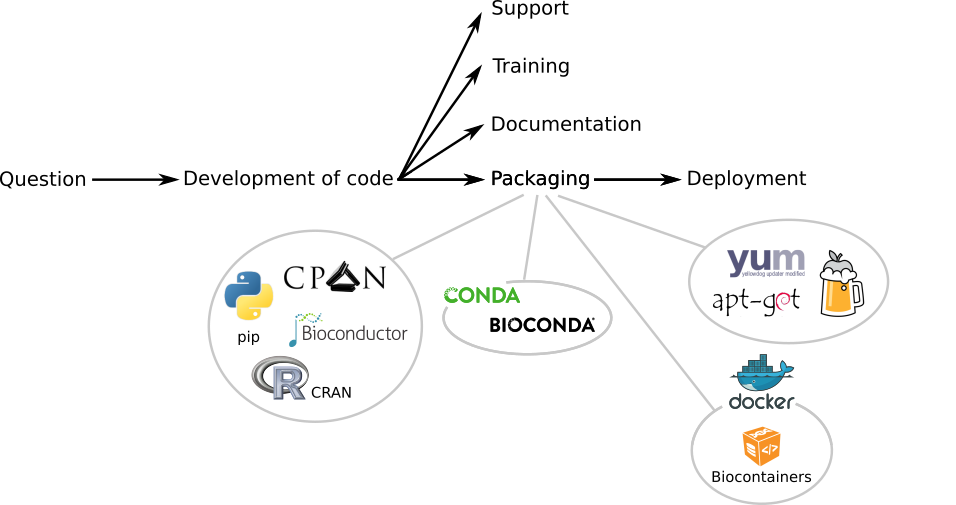
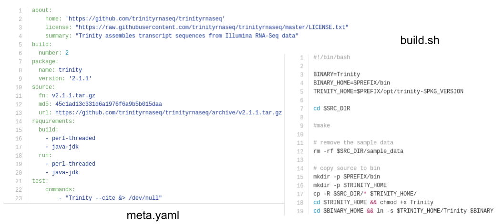

### Tool deployment and sustainability <br>in bioinformatics <br><i class="fa fa-check"></i> Fixed

**Bérénice Batut**, Jonas Weber, Rolf Backofen, Björn Grüning

<small>
University of Freiburg<br><br>Bioinformatics for Human Health and Disease<br>Heidelberg - November 2016
</small> 

---

### Biomedical research

Generation of massive amounts of diverse data

<i class="fa fa-long-arrow-right"></i> Need of bioinformatic solutions and tools

----

### How to develop a tool?


Note: Development of some source code that can be distributed as it is

----

### How to develop a tool?



Note: To help its deployment and ease the usage of the tools, the code is packaged in various package formats.
The tool behind the code is then deployed and used by the targeted users.
 
----

### How to develop a tool?<br>The Golden Path



Note: documentation, training and support are also provided to help users, spread the solution and advertise it. 

----

### But...

Do not you already have to deal with <br>a missing tool dependencies?

Or an older version of a tool could not be installed <br>due to various reasons?

**Major issues in deployment and sustainability**

Note: a major issue for productivity and reproducibility in science

---

# Deployment issue

----

### <i class="fa fa-bullseye"></i> Wanted

A package manager
- Programming language agnostic
- OS independent
    
Note: Development of bioinformatic tools in mostly all available languages and Tools used on every major operating systems

----

### A good solution<br>

- Open Source package manager
- Independent of any programming language and OS
- Fast, robust and easy package installation

  ```
  $ conda install package_name (+ time, take a huge package)
  ```
  
- Installation and management of multiple versions

Note: No need for root privileges

----

### A Conda package



<i class="fa fa-long-arrow-right"></i> Easy to write!

Note: Extensive documentation

----

### Bioinformatics tools<br>


- More than 1,500 bioinformatic packages developed in one year
- Big and fast-growing community
- Newcomer welcoming

Note: Bioconda: a distribution of bioinformatics softwares using Conda

----

### Wants a Docker image?<br>


Note: Wants an higher layer of abstraction and isolation of the base system?

----

### 

A layer donning project to build <br>Docker container from conda package

*what to change?*

----

### How to build your own container

1. Open the file [packages.tsv](https://github.com/mulled/mulled/blob/master/packages.tsv) in edit mode
2. Insert a new line describing your package you want to containerizing
3. Create a Pull Request and wait until our testing passes
4. You are done

<i class="fa fa-long-arrow-right"></i> You have a Docker image waiting for you on [Quay.io](https://quay.io/)

----

### Too complicated?

Not really! Directly plugged on BioConda GitHub repository...

----

### Deployment issue


### <br><i class="fa fa-check"></i>Fixed!

---

# Sustainability issue

----

### <i class="fa fa-bullseye"></i> Wanted

A storage allowing
- Reachability of all packages
- Cache of all versions of the packages
- Permanent access

Note: Permanent cache of all available packages to be always reachable and enable reproducibility

----

### Cargo Port<br>An easy solution

*image*

Note: These packages are long-term stored in a public repository (Cargo Port), the distribution center of the Galaxy Project, resolving the sustainability issue

----

### Sustainability issue

*scheme summary*

### <br><i class="fa fa-check"></i>Fixed!

---

# Conclusion

----

### Tool deployment and sustainability <br>in bioinformatics 


### <br><i class="fa fa-check"></i>Fixed! 

Note: Community effort to create 
  - a flexible, 
  - scalable
  - sustainable system 
to fix the tool deployment problem once and for all
Development of conda packages through the Bioconda community eases the packaging and the deployment of any bioinformatic tool. The interface with Cargo Port enables sustainability by mirroring all sources. Building efficient Linux containers automatically ensures an even higher layer of abstraction and isolation of the base system. Thanks to these collaborative projects, their community and their collaborations, bioinformatics tools can be easily packaged, deployed and will be always available to help biomedical research.

---

## Thank You.

### Questions?


